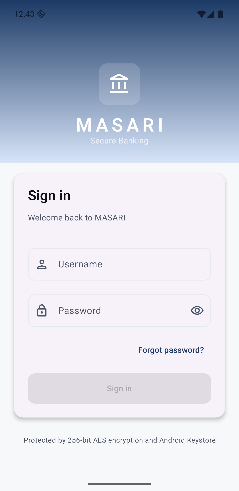
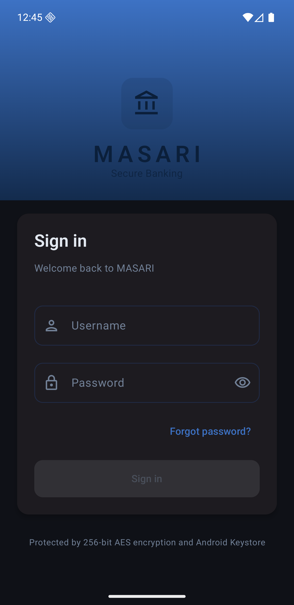
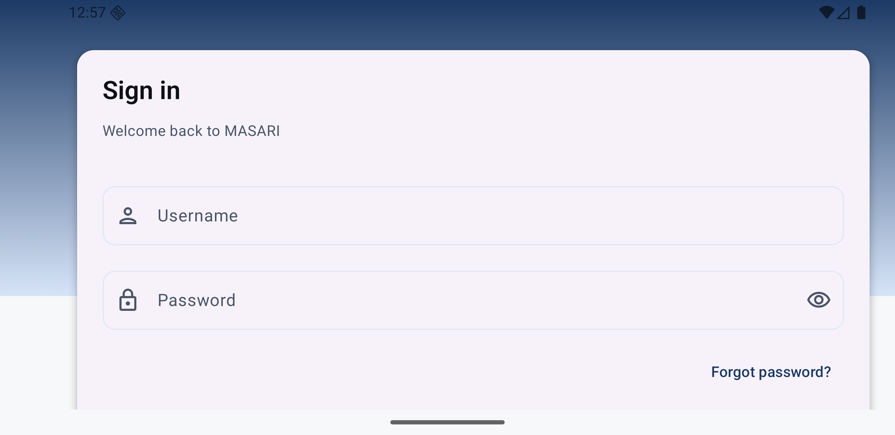
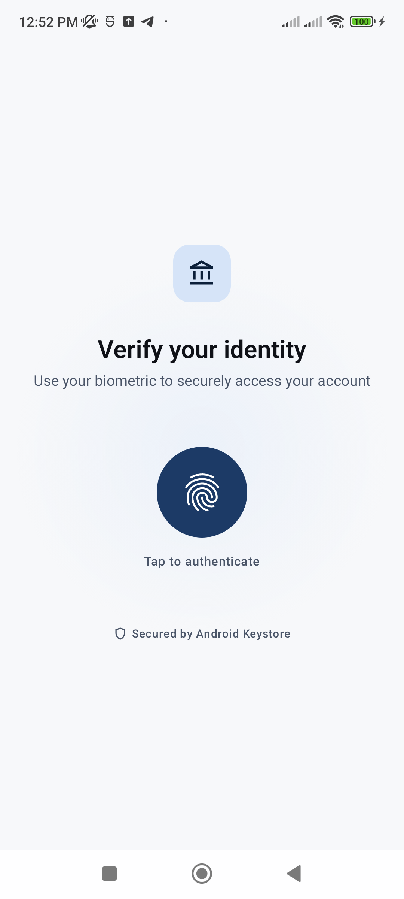
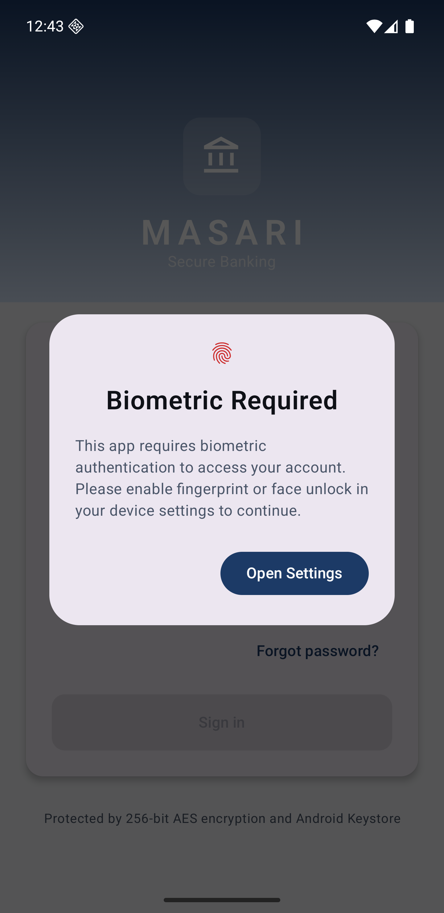
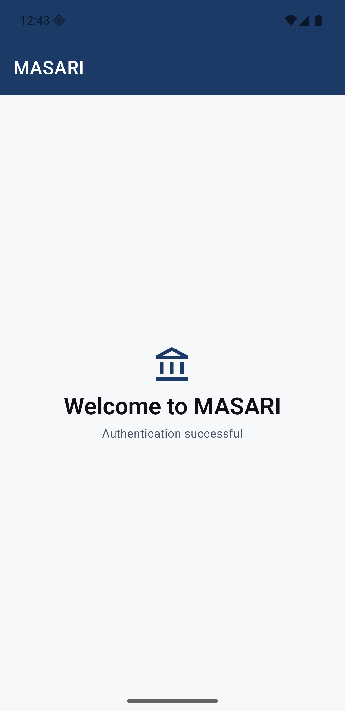
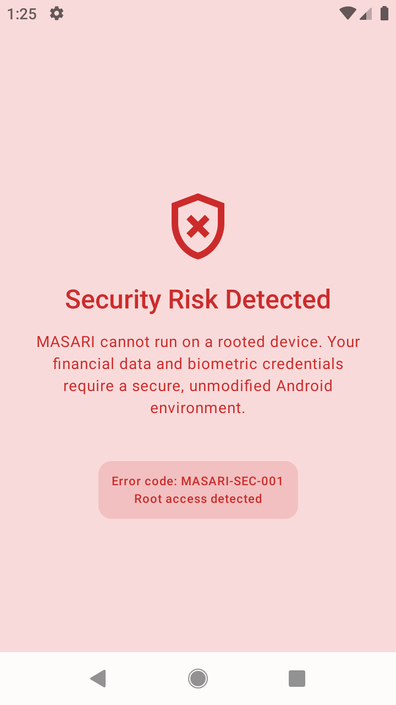

# Secure Biometric Vault

A robust Android application demonstrating best practices for implementing a secure biometric authentication system and encrypted local storage. This project was developed as a challenge to showcase modern Android development techniques, security hardening, and clean architecture.

## Overview

The **Secure Biometric Vault** ensures that sensitive data remains protected through a multi-layered security approach. Users must initially authenticate using traditional credentials to bootstrap the biometric system.

### Key Features
- **Credential-First Authentication:** Initial login is required to establish a secure session before biometric options are available.
- **Biometric Integration:** Seamless biometric login flow using the `androidx.biometric` library.
- **Proactive Availability Checks:** If biometrics are not configured or available, the app intelligently guides the user to the system settings.
- **Root & Emulator Detection:** High-security boundary that prevents the app from running on compromised (rooted) devices or emulators to mitigate tampering risks.

### Working Credentials
For testing purposes, use the following credentials:
- **Username:** `ahmad`
- **Password:** `123456`

---

## Architecture & Design

The project follows a **Feature-based Clean Architecture** combined with the **MVI (Model-View-Intent)** pattern for the presentation layer, ensuring a unidirectional data flow and highly predictable state management.

### SOLID Principles
The codebase is built with strict adherence to SOLID principles, promoting maintainability, scalability, and ease of testing.

### Secure Data Storage
- **DataStore:** Utilizes Jetpack DataStore for modern, asynchronous data persistence, moving away from the deprecated SharedPreferences.
- **SecureAppCache:** A sophisticated implementation of the `AppCache` interface using the **Decorator Pattern**. It leverages **AES encryption** and the **Android KeyStore** to encrypt data at rest, ensuring that even if the storage is accessed externally, the data remains unreadable.

### Root Detection
Currently, the app employs a combination of the **RootBeer** library and custom emulator detection methods. 
> **Future Roadmap:** Transition to the **Google Integrity API** for server-side attestation, as local detection methods are inherently susceptible to bypass by advanced tools.

---

## Error Handling

A unified error handling strategy is implemented to distinguish between user-recoverable errors and system exceptions.

- **AppError:** Used to represent domain-specific errors that require user feedback.
- **Result Pattern:** Inner layers return a `Result` type, forcing explicit handling of success and failure states.
- **ViewModelErrorHandlerDelegate:** An abstraction layer that allows ViewModels to share error handling logic through delegation, reducing boilerplate while maintaining decoupling.
- **Reporting:** Exceptions are currently logged locally, but the structure is ready for integration with crash reporting tools like Firebase Crashlytics.

---

## Testing

The project includes a few unit and ui tests for demonstration purposes.
The decoupled nature of the architecture makes the system easily testable and allows for mocking dependencies with ease.

---

## Screenshots

| Login (Light) | Login (Dark) | Login (Landscape) |
| :---: | :---: | :---: |
|  |  |  |

| Biometric Verify | Biometric Required | Success Screen | Root Detected |
| :---: | :---: | :---: | :---: |
|  |  |  |  |

---
